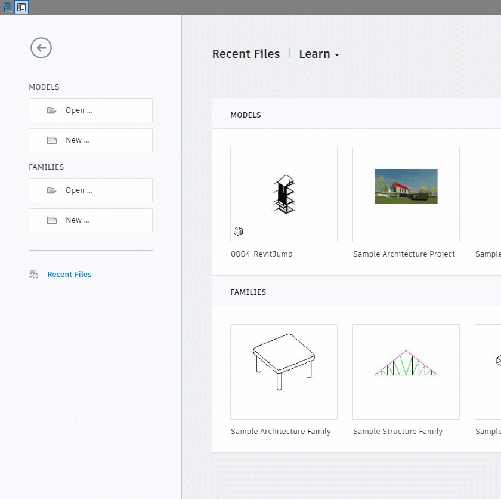

# \#2

## Совместная работа

Как и Archicad, Revit предоставляет возможность совместной работы над файлами проекта.

### Создание файла центральной модели

Настройка пути для локальных данных.

На панели инструментов выбрать Совместная работа \(Collaborate\) -&gt; Совместная работа \(Collaborate\).

### Особенности открытия файлов

Оптимально открывать созданием локальной копии на основе центральной модели, с добавлением штампа даты.

### Рабочие наборы

Рабочие наборы \(Worksets\) – совокупность пользовательских элементов, семейств, видов и настроек с возможностью назначения Владельца и Заемщика для процессов коллективной работы:  
Владелец \(Owner\) – пользователь с правами на редактирование Элементов и Наборов.  
Заемщик \(Borrower\) – пользователь с временными правами на редактирование Элементов и Наборов с последующим их освобождением.  
В Revit предусмотрено создание Пользовательских наборов, в которые можно добавлять Элементы моделей с последующим закреплением прав использования, а также Наборов стандартов, Семейств и Видов. Процесс назначения прав происходит путем создания Наборов и последующего их самозахвата.

### [Хорошая практика работы в групповом проекте](https://knowledge.autodesk.com/support/revit-products/learn-explore/caas/CloudHelp/cloudhelp/2015/ENU/Revit-Collaborate/files/GUID-80D390B3-D751-4703-BC79-1A66497C1928-htm.html)

* Глобальная настройка видимости Рабочих наборов
* Использование только "Обновить до последней версии" \(Reload Latest\) вместо полной синхронизации
* "Отключить экран совместной работы" \(Workset display mod\)
* Закрытие неиспользуемых ворксетов
* Периодически выполнять “Сжать модели из хранилища” и "Проверить"

## Настройки проекта

### Стили линий

Стили линии \(Line Styles\) формируются из:

* Образцы линий \(Line Patterns\) 
* Веса линий \(Line Weights\)

### Создание подкатегорий видимости

### Импорт настроек из другого файла

## Опорные элементы

#### Опорные уровни \(Levels\) и Сетка осей \(Grid\)

Как и Опорные плоскости \(Reference Plane\) могут являться базовой зависимостью для элементов. Отображаются, когда расположены ортогонально плоскости Вида и попадают в сечение. Пересечение Осей «А» и «1» и Уровня «1», желательно, чтобы совпадало с проектным нулем \(Project base point\) и системным началом координат \(System Origin\).

## Запись



> **Домашнее задание**
>
> Создать групповой проект в котором будет сетка осей 7200 x 7200 и 5 опорных уровней с шагом 3300 по вертикали.

