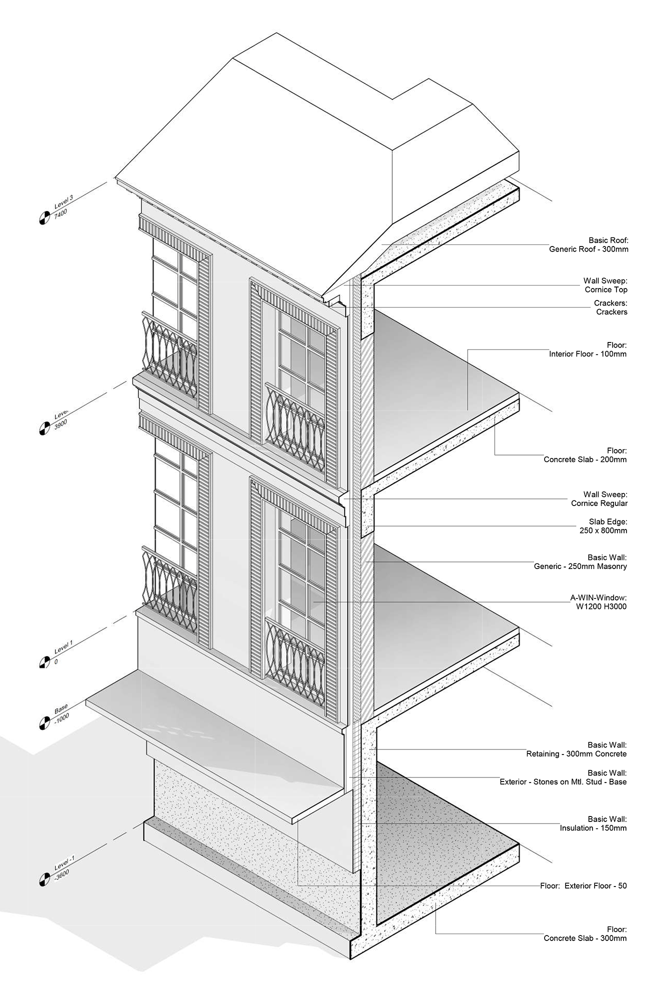

# Фрагмент фасада

Воспроизвести фрагмент фасада, как на изображении

Ниже находятся два Revit файла.

 **RevitJump-04-Task-Reference** ─ исходный файл с которого сделано изображение.



 **RevitJump-04-Task-Empty** ─ содержит все необходимые Типы элементов, но сформировать модель из Экземпляров необходимо самостоятельно.



