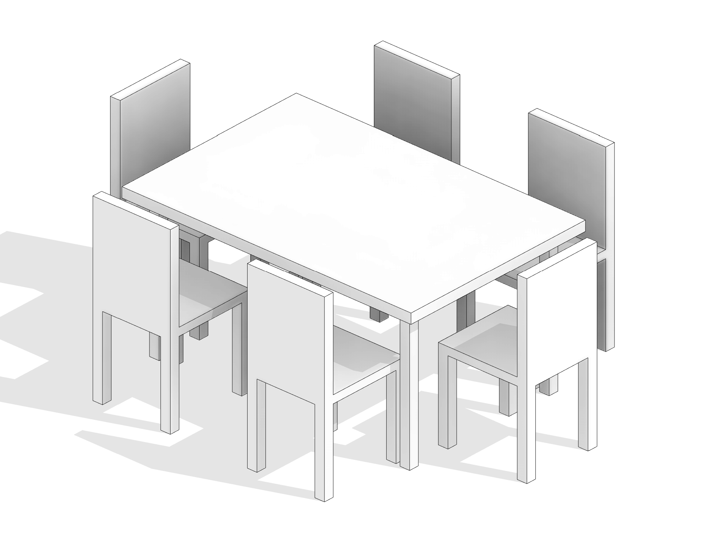

# Untitled





> [Синтаксис формул \(Autodesk Knowledge\)](https://knowledge.autodesk.com/ru/support/revit-products/learn-explore/caas/CloudHelp/cloudhelp/2019/RUS/Revit-Model/files/GUID-B37EA687-2BDF-4712-9951-2088B2A8E523-htm.html)

> [Условные выражения для формул \(Autodesk Knowledge\)](https://knowledge.autodesk.com/ru/support/revit-products/learn-explore/caas/CloudHelp/cloudhelp/2019/RUS/Revit-Model/files/GUID-A0FA7A2C-9C1D-40F3-A808-73CD0A4A3F20-htm.html)

