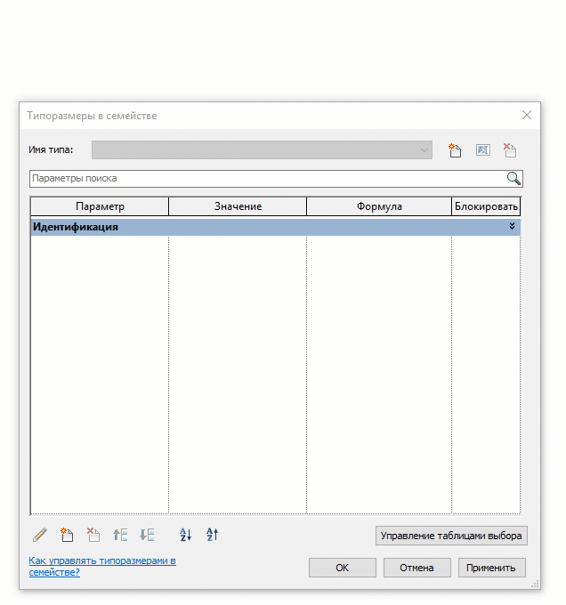
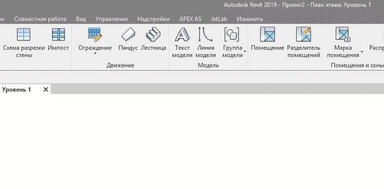

# \#8

## Параметры, параметры, свойства, параметры…

Остальные настройки проекта на вкладке Управление \(Manage\)

### Параметры семейств

Могут либо свойством Типа \(Типоразмера\) либо свойством Экземпляра. Параметры бывают различными по типу принимаемых данных \(Текст, Длина, Площадь, Да/Нет, Тип семейства и др.\) 

Параметр можно указывать в качестве марки для зависимостей, таким образом можно параметризировать геометрические размеры в семействе.

Параметры семейства можно ассоциировать со значениями свойст вложенных в семейство элементов.

Значения Параметров семейства можно выражать через значения других Параметров посредством Формул

Параметр может использоваться лишь для вывода значений. \(Опция "Параметр для отчетов"\)

Для того, чтобы значения свойств можно было выводить в спецификации, Параметр должен быть "Общим" \(Shared\)

### Shared parameters \(Общие параметры\)

### Параметры проекта

### Global parameters \(глобальные параметры\)

## Подсчеты и спецификации

Виды спецификаций

* Элементов
* Материалов
* Листов
* и др...

### Настройка спецификации

> [Спецификации \(Autodesk Knowledge\)](https://knowledge.autodesk.com/support/revit-products/learn-explore/caas/CloudHelp/cloudhelp/2014/ENU/Revit/files/GUID-D857A195-24B3-42BE-A0D7-366B81B57EE3-htm.html)

### Формулы, Синтаксис

> [Условные выражения в формулах \(Autodesk Knowledge\)](https://knowledge.autodesk.com/support/revit-products/learn-explore/caas/CloudHelp/cloudhelp/2018/ENU/Revit-Model/files/GUID-A0FA7A2C-9C1D-40F3-A808-73CD0A4A3F20-htm.html)
>
> [Синтаксис в формулах \(Autodesk Knowledge\)](https://knowledge.autodesk.com/support/revit-products/learn-explore/caas/CloudHelp/cloudhelp/2018/ENU/Revit-Model/files/GUID-B37EA687-2BDF-4712-9951-2088B2A8E523-htm.html)

## Запись



